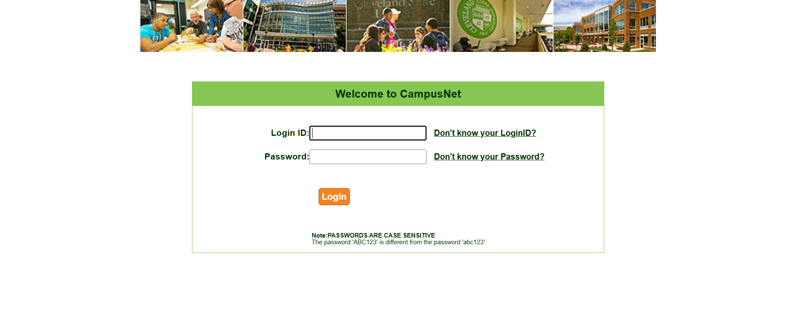
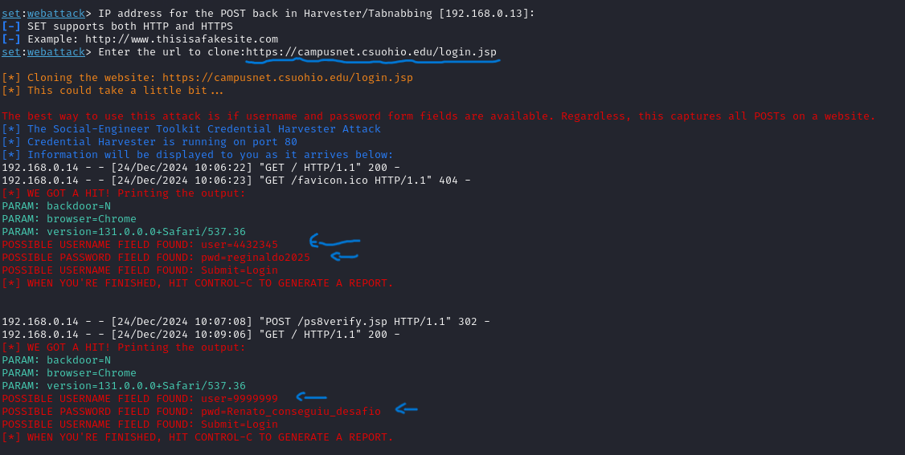

# Phishing para captura de senhas de Sites que tenham Login

O phishing foi feito a partir do site de login da Universidade de Cleveland nos EUA. 
Infelizmente, por alguma medida adicional de segurança, o phishing do facebook não
foi possível realizar. Todavia, foi realizado com sucesso ao escolher um outro site
de login com possível segurança reduzida.

### Ferramentas

- Kali Linux
- setoolkit

### Configurando o Phishing no Kali Linux

- Acesso root: ``` sudo su ```
- Iniciando o setoolkit: ``` setoolkit ```
- Tipo de ataque: ``` Social-Engineering Attacks ```
- Vetor de ataque: ``` Web Site Attack Vectors ```
- Método de ataque: ```Credential Harvester Attack Method ```
- Método de ataque: ``` Site Cloner ```
- Obtendo o endereço da máquina: ``` ifconfig ```
- URL para clone: (https://campusnet.csuohio.edu/login.jsp)

### Resutados




